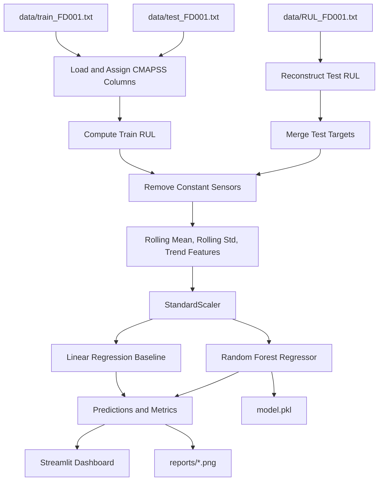

# NASA CMAPSS RUL Streamlit Dashboard

An end-to-end predictive maintenance project for estimating Remaining Useful Life (RUL) of turbofan engines using the NASA CMAPSS FD001 dataset, a feature-engineered machine learning pipeline, and an interactive Streamlit dashboard.

## Overview

This repository implements a lightweight prognostics workflow over the NASA CMAPSS turbofan degradation benchmark. The project:

- loads the local FD001 train, test, and RUL files
- reconstructs row-level RUL targets for both train and test trajectories
- removes constant or non-informative sensors
- engineers temporal features using rolling statistics and first-order trends
- standardizes model inputs with `StandardScaler`
- trains a `RandomForestRegressor` for nonlinear RUL estimation
- compares the main model against a linear baseline
- serves diagnostics and interpretability views through Streamlit

The dashboard is designed for both demonstration and analysis. It does not just show predictions. It explains the technical problem, documents the modeling methodology, compares models, and interprets the charts directly in the UI.

## Problem Definition

The NASA CMAPSS FD001 subset represents a fleet of turbofan engines operating under one condition with one fault mode. Each engine is observed over time as a multivariate trajectory:

`x(i, t) = [settings(i, t), sensors(i, t)]`

Where:

- `i` is the engine identifier
- `t` is the cycle index
- each row contains 3 operational settings and 21 sensor measurements

For training engines, failure is observed. Row-level RUL is computed as:

`RUL(i, t) = T_fail(i) - t`

For test engines, trajectories are truncated before failure. The file `RUL_FD001.txt` provides the terminal offset after the final observed cycle, allowing row-level target reconstruction across the full test trajectory.

The objective is to learn a regression function:

`f(x(i, 1:t)) -> RUL(i, t)`

This is a core predictive maintenance task because accurate RUL estimates support condition-based maintenance, improve asset availability, and reduce failure risk.

## Dataset Summary

The implementation is currently configured for the local FD001 split in `data/`.

| Property | Value |
|---|---:|
| Training trajectories | 100 |
| Test trajectories | 100 |
| Operating conditions | 1 |
| Fault modes | 1 |
| Operational settings | 3 |
| Sensor channels | 21 |

Local files used:

- `data/train_FD001.txt`
- `data/test_FD001.txt`
- `data/RUL_FD001.txt`

## Methodology

### 1. Data Ingestion

The raw CMAPSS text files are loaded with the standard schema:

- `engine_id`
- `cycle`
- `setting_1`, `setting_2`, `setting_3`
- `sensor_1` to `sensor_21`

### 2. Target Construction

- Training RUL is derived from the maximum observed cycle for each engine.
- Test RUL is reconstructed by combining the final observed cycle with the per-engine terminal RUL offsets from `RUL_FD001.txt`.

### 3. Sensor Filtering

Constant or non-informative sensors are removed before feature engineering. In the current FD001 run, the following sensors are excluded:

- `sensor_1`
- `sensor_5`
- `sensor_6`
- `sensor_10`
- `sensor_16`
- `sensor_18`
- `sensor_19`

That leaves:

- `14` retained sensor channels

### 4. Feature Engineering

For each retained sensor and each engine trajectory, the pipeline computes:

- raw sensor value
- rolling mean with window size `5`
- rolling standard deviation with window size `5`
- first-order difference trend

Base predictors also include:

- `cycle`
- `setting_1`
- `setting_2`
- `setting_3`

Total model input dimensionality in the current configuration:

- `60` features

### 5. Scaling

`StandardScaler` is fit on the training split only, then applied to both train and test features to prevent leakage.

### 6. Modeling

Two regressors are trained:

- `RandomForestRegressor` as the primary nonlinear model
- `LinearRegression` as the baseline comparator

The Random Forest is a strong fit for this project because it can model nonlinear interactions between settings, smoothed sensor levels, and local trends without requiring deep sequence architectures.

### 7. Evaluation

The project reports:

- `RMSE` for sensitivity to larger errors
- `MAE` for average absolute prediction error
- `Pearson correlation coefficient` for alignment between predicted and actual RUL trends

## Pipeline Diagram



## Current Results

The following metrics were produced by the current local run of the pipeline:

| Model | RMSE | MAE | Pearson r |
|---|---:|---:|---:|
| Random Forest | 41.3971 | 31.0223 | 0.7135 |
| Linear Baseline | 42.7896 | 32.9424 | 0.6929 |

Interpretation:

- The Random Forest improves both RMSE and MAE over the linear baseline.
- The Pearson correlation is also higher for the Random Forest, indicating better alignment with the true RUL trend.
- The gap is not massive, which is useful: it shows the baseline is non-trivial, while the nonlinear model still provides measurable value.

## Dashboard Capabilities

The Streamlit app exposes:

- technical problem statement and methodology in collapsible sections
- baseline comparison table
- RUL distribution histogram
- sensor degradation curve for a selected engine and sensor
- feature importance chart
- feature explanation and insights table
- actual vs predicted line plot
- scatter plot with correlation coefficient
- residual error distribution
- prediction sample table

All major charts are accompanied in the UI by:

- what the graph shows
- how the graph works
- why the graph matters

## Interface Screenshots

All diagrams below are rendered directly from the repository `screenshots/` folder.

### Technical Context


### Exploratory Diagnostics


### Prediction Diagnostics


## Repository Structure

```text
rul-streamlit-project/
|
|-- app.py
|-- preprocess.py
|-- train.py
|-- model.pkl
|-- requirements.txt
|-- run.txt
|
|-- data/
|   |-- train_FD001.txt
|   |-- test_FD001.txt
|   |-- RUL_FD001.txt
|
|-- reports/
|   |-- actual_vs_pred.png
|   |-- residual_plot.png
|   |-- feature_importance.png
|   |-- rul_distribution.png
|
|-- screenshots/
|   |-- dashboard captures used in this README
```

## Module Responsibilities

### `preprocess.py`

Responsible for:

- loading CMAPSS text files
- assigning standard column names
- computing train and test RUL targets
- removing constant sensors
- generating rolling and trend features
- fitting and applying the scaler

### `train.py`

Responsible for:

- preparing processed train and test matrices
- training the Random Forest model
- training the linear baseline
- computing RMSE, MAE, and Pearson correlation
- saving `model.pkl`
- generating report images in `reports/`

### `app.py`

Responsible for:

- launching the Streamlit dashboard
- retraining from the default local FD001 split
- exposing dynamic controls
- rendering metrics, diagnostics, and explanations

## Artifacts

Training produces:

- `model.pkl`
- `reports/actual_vs_pred.png`
- `reports/residual_plot.png`
- `reports/feature_importance.png`
- `reports/rul_distribution.png`

## Quick Start

### 1. Install dependencies

```powershell
py -m pip install -r requirements.txt
```

### 2. Launch from the VS Code integrated terminal

```powershell
cd "C:\Users\jaypr\Desktop\coding\project\DS HOT"
py -m streamlit run app.py --server.port 8501
```

If port `8501` is busy:

```powershell
py -m streamlit run app.py --server.port 8502
```

You can also follow the quick terminal instructions in `run.txt`.

## Example Workflow

1. Start the dashboard.
2. Let the app train on the default FD001 files.
3. Review the collapsible technical problem statement and methodology.
4. Compare Random Forest against the linear baseline.
5. Inspect the sensor degradation curve for selected engines and sensors.
6. Use feature importance and feature explanations to understand model behavior.
7. Examine prediction quality through the line plot, scatter plot, and residual histogram.

## Technical Notes

- The project is intentionally lightweight and favors interpretability over heavy deep learning architectures.
- The current dashboard uses the default FD001 split from local files only.
- The feature pipeline is engine-aware, meaning rolling statistics and trends are computed within each engine trajectory rather than globally across the dataset.
- The test RUL reconstruction respects the right-censored nature of the CMAPSS benchmark.


## Reference

Dataset and benchmark context are documented in the local CMAPSS files:

- `data/readme.txt`
- `data/Damage Propagation Modeling.pdf`
